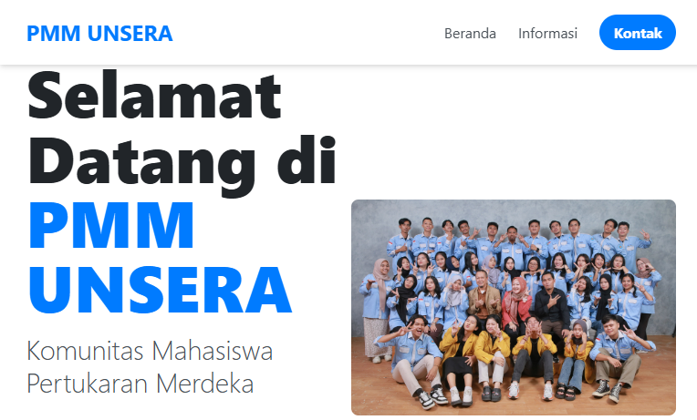

<p align="center">
  
</p>

<h1 align="center">Aplikasi PMM UNSERA</h1>

<p align="center">
  Sebuah platform web informatif dan modern yang dirancang untuk menjadi pusat komunitas bagi mahasiswa Pertukaran Mahasiswa Merdeka (PMM) di Universitas Serang Raya (UNSERA).
  <br />
  <br />
  <a href="#">Lihat Demo</a>
  ·
  <a href="https://github.com/USERNAME/REPO_NAME/issues">Laporkan Bug</a>
  ·
  <a href="https://github.com/USERNAME/REPO_NAME/issues">Minta Fitur</a>
</p>

---

## 🚀 Gambaran Umum

Aplikasi PMM UNSERA adalah solusi digital untuk menyatukan komunitas mahasiswa PMM di UNSERA. Dengan antarmuka yang intuitif, responsif, dan menarik, aplikasi ini menyediakan akses terpusat ke semua informasi penting, mulai dari jadwal kegiatan hingga direktori mahasiswa. Tujuannya adalah untuk memudahkan mahasiswa baru beradaptasi dan terhubung satu sama lain.

## ✨ Fitur Utama

*   📱 **Desain Responsif**: Tampilan yang optimal di berbagai perangkat, baik desktop maupun mobile.
*   📅 **Jadwal Dinamis**: Akses mudah ke jadwal kegiatan, acara, dan tenggat waktu penting.
*   👤 **Direktori Mahasiswa**: Direktori interaktif dengan fitur pencarian untuk menemukan dan terhubung dengan sesama mahasiswa PMM.
*    GUIDE **Panduan Lokal**: Informasi penting tentang akomodasi, tempat makan, layanan kesehatan, dan tempat menarik di sekitar kampus.
*   📞 **Kontak Koordinator**: Informasi kontak yang jelas untuk koordinator dan staf program.
*   🧩 **Komponen Modular**: Header dan footer yang dapat digunakan kembali untuk konsistensi di seluruh halaman.

## 🛠️ Teknologi yang Digunakan

Proyek ini dibangun menggunakan teknologi web modern yang berfokus pada kinerja dan kemudahan pemeliharaan:

*   **HTML5**: Untuk struktur konten yang semantik.
*   **CSS3**: Untuk styling modern dan tata letak.
*   **JavaScript (ES6+)**: Untuk fungsionalitas interaktif.
*   **Tailwind CSS**: Untuk utility-first styling yang cepat dan efisien.
*   **Font Awesome**: Untuk ikonografi yang kaya dan konsisten.
*   **Google Fonts**: Untuk tipografi yang modern dan mudah dibaca.

## 📁 Struktur Proyek

```
.
├── 📄 index.html         # Halaman utama
├── 📄 direktori.html     # Halaman direktori mahasiswa
├── 📁 src/
│   ├── 📄 input.css       # File input untuk Tailwind CSS
│   └── 📄 style.css      # File output CSS
├── 📁 assets/
│   └── 🖼️ (gambar & ikon)
├── 📄 app.js             # Logika utama aplikasi
├── 📄 direktori.js       # Skrip khusus untuk halaman direktori
├── 📄 tailwind.config.js # Konfigurasi Tailwind CSS
└── 📄 README.md          # Anda sedang membacanya :)
```

## ⚙️ Instalasi dan Penggunaan

Untuk menjalankan proyek ini secara lokal, ikuti langkah-langkah berikut:

1.  **Clone Repositori**
    ```bash
    git clone https://github.com/USERNAME/REPO_NAME.git
    cd REPO_NAME
    ```

2.  **Install Dependencies**
    Jika Anda ingin memodifikasi gaya, Anda perlu menginstal dependensi Tailwind CSS.
    ```bash
    npm install
    ```

3.  **Jalankan Build CSS (Opsional)**
    Untuk mengkompilasi file `input.css` menjadi `style.css` saat Anda melakukan perubahan:
    ```bash
    npm run build
    ```

4.  **Buka di Browser**
    Buka file `index.html` di browser favorit Anda untuk melihat aplikasi.

## 🤝 Kontribusi

Kontribusi Anda sangat kami hargai! Jika Anda ingin membantu, silakan:

1.  **Fork** proyek ini.
2.  Buat **Branch** baru (`git checkout -b fitur/NamaFitur`).
3.  **Commit** perubahan Anda (`git commit -m 'Menambahkan fitur luar biasa'`).
4.  **Push** ke Branch (`git push origin fitur/NamaFitur`).
5.  Buka **Pull Request**.

Jangan ragu untuk membuka *issue* jika Anda menemukan bug atau memiliki saran.

---

<p align="center">Dibuat dengan ❤️ untuk komunitas PMM UNSERA.</p>
